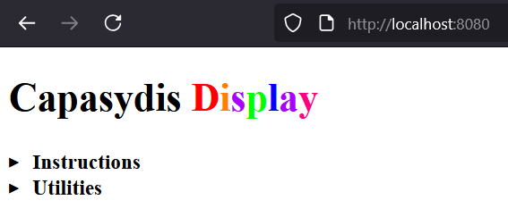
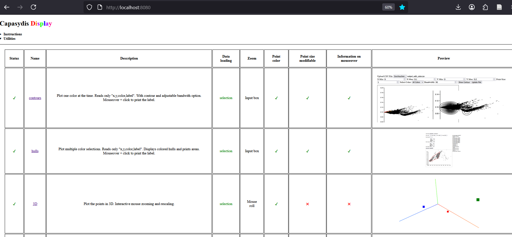

This directory presents a series of utilities written in HTML and leveraging the D3.js and Three.js libraries to render and interact with large data points. For the NR99 data, the plotly library implemented in R was sufficient for a descent 3D rendering of the images. For larger projects, the provided D3.js utilities may come handy.


## start the go server
```
go run main.go
```

You should see the following text in your console: `Server listening on port 8080...`
This opens the index.html on the local browser of your machine.
In your browser, go to: 
http://localhost:8080/

and check the **Utilities** for current implemented graphics.


An example dataset is provided in the data/ folder.
Please note this data set was produced with low precision (e-6) for the coordinate calculations, so it is not recommended to be used for finer mapping or biological inference (use instead the data with e-10 precision).

Note: The data needs to be unzipped before it can be uploaded interactively by the HTML utilities.

## Some snapshots

[](https://www.google.com/)
[](https://www.google.com/)