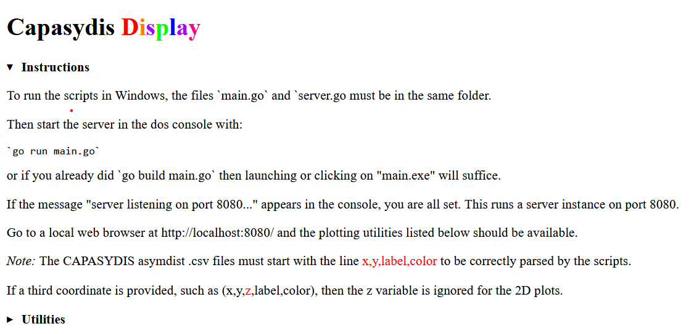

# HTML and JavaScript utilities to display large seqverses

This directory presents a series of utilities written in HTML and leveraging the D3.js and Three.js libraries to render and interact with large data points. For the NR99 data, the plotly library implemented in R was sufficient for a descent 3D rendering of the images. For larger projects, the provided D3.js utilities may come handy.


## 1) Start the go server (go should be installed and running)   

Go should be installed [Go installation](https://go.dev/doc/install) on your machine.
Then start the local server:    

```
go run main.go
```

You should see the following text in your console: `Server listening on port 8080...`
This opens the index.html on the local browser of your machine.

## 2) In your browser, go to: 
http://localhost:8080/

and check the **Utilities** links on the HTML form for current implemented graphics.


An example dataset is provided in the data/ folder.
Please note this data set was produced with __low precision__ (e-6) for the coordinate calculations, so it is **not** recommended to be used for finer mapping or biological inference (use instead the data with e-10 precision).

**Note**: The data needs to be unzipped before it can be uploaded interactively by the HTML utilities.

## Some snapshots of the index.html form:

[]()

After clicking on the "Utilities" button, you should see the following:

[]()